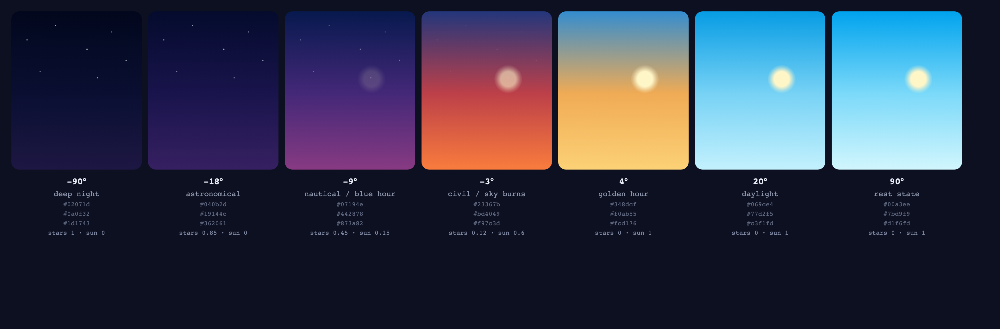

# Build spec: `sky.riv`

A brief for building one Rive file that replaces the site's sky rendering. Hand
this to whoever is working in the Rive editor.

The point of this file is the thing no Lottie file can do: **the animation is a
function of live data**. The page will feed it the sun's real elevation, and the
file will show the corresponding sky. It is not a loop that happens to look like
a sunset — at 3am it *is* night, and it moves continuously toward dawn.

If it only plays back, it is not worth building. See
[rive-evaluation.md](rive-evaluation.md) for why.

---

## The naming contract

The page talks to the file through these names. They must match exactly —
they are case-sensitive, and a typo means silence rather than an error.

| Thing | Name | Notes |
|---|---|---|
| Artboard | `Sky` | |
| State machine | `SkyMachine` | |
| Input 1 | `solarElevation` | **Number**, −90 to 90 |
| Input 2 | `sunArc` | **Number**, 0 to 1 |
| Input 3 | `isPolar` | **Boolean** |

Nothing else is read. Extra artboards or animations are fine and will be ignored.

---

## Input 1 — `solarElevation` (Number, −90…90)

The sun's angle above the horizon, in degrees. Negative is below it. This is the
main input and it changes continuously.

Drive it with a **1D Blend State** inside `SkyMachine`. Create seven timelines,
each a still frame of the sky at one elevation, and set the blend thresholds to
these exact values. Rive interpolates between them, which is what makes dusk a
sweep rather than a cut.

The colours are the site's own palette, so the Rive file and the surrounding page
agree. Take them literally.

| elevation | sky top | sky mid | horizon | accent | glow | stars | sun |
|---|---|---|---|---|---|---|---|
| -90° | `#02071d` | `#0a0f32` | `#1d1743` | `#7ca2f6` | `#3b4668` | 1 | 0 |
| -18° | `#040b2d` | `#19144c` | `#362061` | `#95a5ff` | `#514d85` | 0.85 | 0 |
| -9° | `#07194e` | `#442878` | `#873a82` | `#e196f3` | `#b25196` | 0.45 | 0.15 |
| -3° | `#23367b` | `#bd4049` | `#f97c3d` | `#ff9960` | `#ff932a` | 0.12 | 0.6 |
| 4° | `#348dcf` | `#f0ab55` | `#fcd176` | `#ffb147` | `#ffdd6e` | 0 | 1 |
| 20° | `#069ce4` | `#77d2f5` | `#c3f1fd` | `#00b2f9` | `#fff6c8` | 0 | 1 |
| 90° | `#00a3ee` | `#7bd9f9` | `#d1f6fd` | `#00b7fa` | `#fff9cb` | 0 | 1 |



*The seven blend states, rendered from the values above. Build to these.*

Reading the table:

- **sky top** — colour at the top of the artboard
- **sky mid** — roughly 52% down
- **horizon** — the bottom of the sky, where it meets the ground
- **accent** — not painted; it is the page's UI colour at that elevation. Useful
  for picking a sun/moon tint that agrees with the chrome around it.
- **glow** — the halo around the sun or moon disc
- **stars** — opacity of the star layer, 0 to 1
- **sun** — opacity of the sun disc, 0 to 1. Where this is 0, the moon shows
  instead; cross-fade the two between −9° and −3°.

Most of the visible change happens between **−18° and +6°**. Above about 20° the
sky barely moves, which is why the last two rows are nearly identical — they exist
so the blend has somewhere to rest.

## Input 2 — `sunArc` (Number, 0…1)

Where the sun or moon sits along its path. `0` is rising at the left edge, `0.5`
is highest, `1` is setting at the right edge.

The page computes this from the real sunrise and sunset for the city being shown,
so at 09:00 on a 14-hour day it will be about `0.21`.

Drive the disc's position from this along a shallow arc. Not a semicircle — a
semicircle looks wrong in a wide, short artboard. Peak height around 55–60% of
the artboard height works.

**This must be independent of `solarElevation`.** They are related in reality but
arrive separately, and coupling them in the file will fight the data.

## Input 3 — `isPolar` (Boolean)

True inside the Arctic and Antarctic circles when the sun does not rise or set
that day. When true, park the disc mid-arc and ignore `sunArc`, which is
meaningless with no sunrise to measure from.

Roughly 1 in 20 sessions will hit this, and it looks broken without handling:
the disc sits at the far left all day.

---

## Artboard

- **720 × 420**, matching the existing scenes.
- Design so it can be cropped: it is used full-bleed behind the hero and again at
  around 200 × 96 behind each city card. Nothing important in the outer 10%.
- **Transparent background.** The page paints its own surface behind this.

## What to include

Required — these replace existing page elements:

1. **Sky gradient** — three stops, from the table.
2. **Sun and moon discs** with glow, cross-fading per the `sun` column. The moon
   should read as a crescent.
3. **Star field** — fading per the `stars` column. Twinkle is welcome but keep it
   slow; the current page uses a 4.5s cycle with staggered phases.

Optional, if there is appetite:

4. Clouds, tinted by elevation — they catch colour at sunrise, which is most of
   why a real sunrise looks like one.
5. A city skyline silhouette along the bottom, with windows that come on as
   `solarElevation` drops below about −3°.

## Performance

This may run in up to 20 instances at once, one per city card.

- Keep it under **50 KB**.
- Avoid raster assets entirely — they will not scale to card size and they
  balloon the file.
- Prefer few shapes with animated properties over many shapes toggling opacity.

---

## How the page will drive it

Ready to drop in once the file exists:

```ts
const inputs = rive.stateMachineInputs('SkyMachine');
const elevation = inputs.find((i) => i.name === 'solarElevation');
const arc       = inputs.find((i) => i.name === 'sunArc');
const polar     = inputs.find((i) => i.name === 'isPolar');

// Already computed per city, four times a second, in src/core/solar.ts
const sun = solarSnapshot(instant, city.lat, city.lon);
elevation.value = sun.elevation;
polar.value     = !sun.sunrise || !sun.sunset;
arc.value       = polar.value
  ? 0.5
  : (instant - sun.sunrise) / (sun.sunset - sun.sunrise);
```

## Acceptance checks

Drop the file in and run:

```
node scripts/preview-rive.mjs <dir>
```

It passes when:

1. It reports artboard `Sky` and state machine `SkyMachine`.
2. It reports three drivable inputs. **If this says `NONE — playback only`, the
   inputs were not exposed on the state machine and the file will not work** —
   this is the exact failure that ruled out every off-the-shelf file.
3. Setting `solarElevation` to −40, −6, 0, 8 and 45 gives five visibly different
   skies, matching the table rows either side.
4. Sweeping `solarElevation` from −20 to +10 is a continuous sweep with no jumps.
5. At 200 × 96 the sun is still legible and the stars have not become mush.

## Budget note

Adopting this means shipping Rive's runtime: **837 KB gzipped**, against Lottie's
77 KB. One file doing the work of the sky, the sun's position and the star fade
across every card is the case where that is arguably worth it. One decorative
loop is not.
